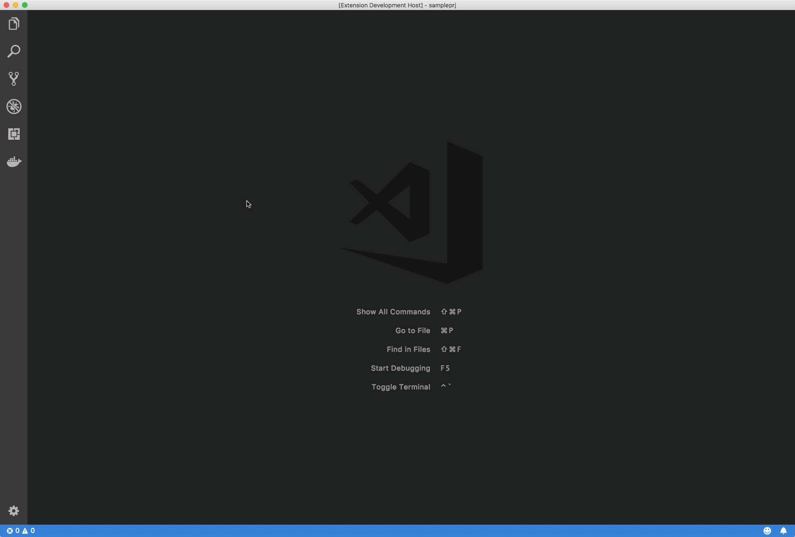
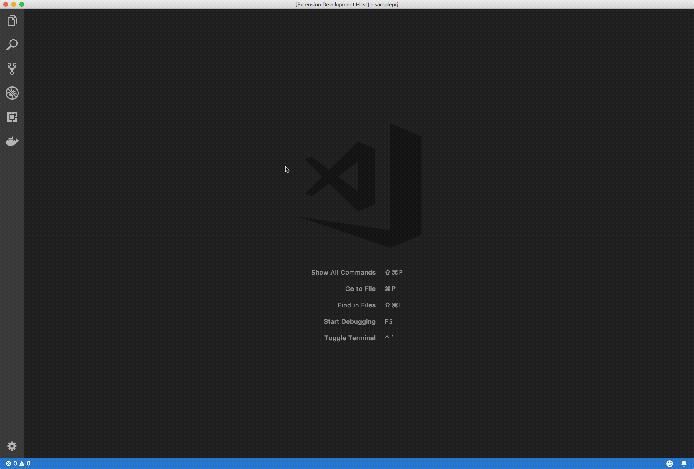
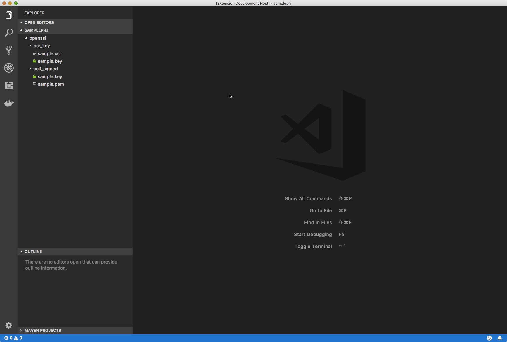
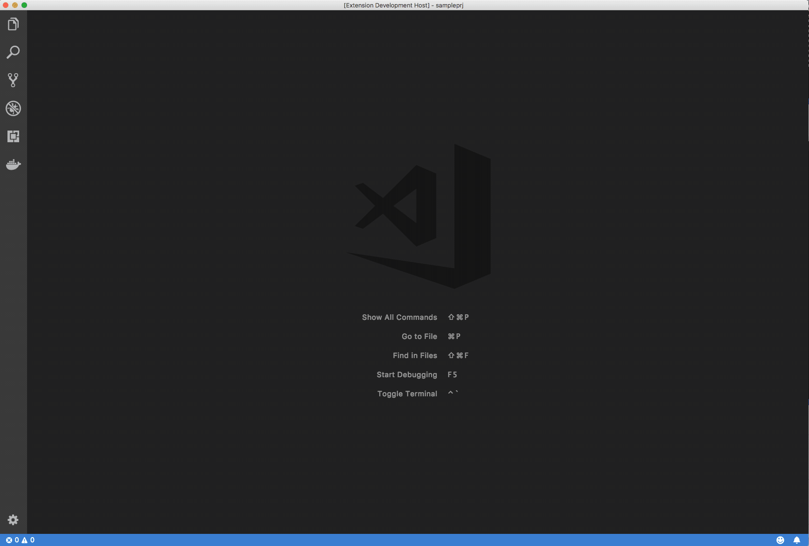
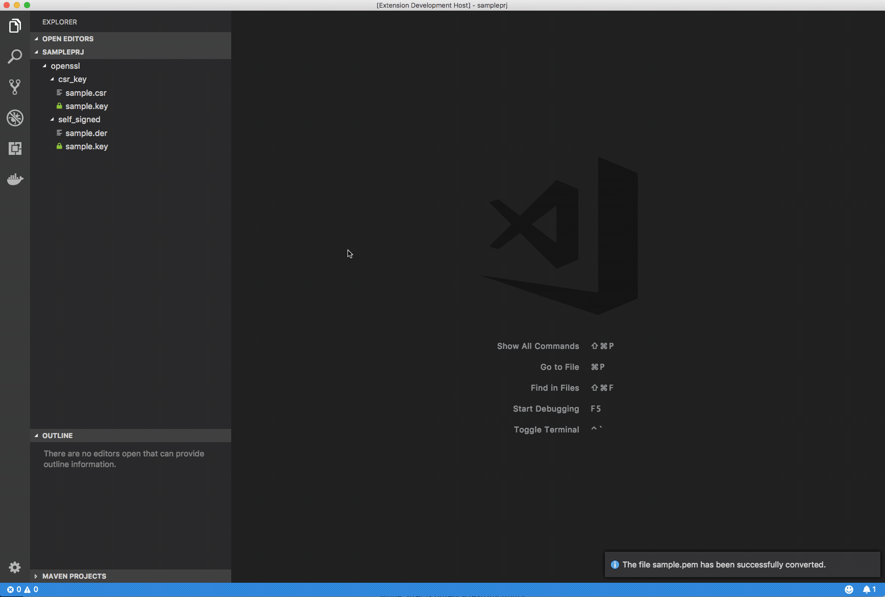

# OpenSSL Utils

OpenSSL utils allows you to invoke the most frequent OpenSSL commands directly from Visual Studio Code.

## Features

### Generate Private Key

### Generate RSA Private Key and Certificate Signing Request 

### Generate self-signed Certificate and Private Key

### Certificate and CSR preview

### Export PKCS#12

### Convert PEM encoded Certificate to DER

### Convert DER encoded Certificate to PEM

## Requirements

You must have OpenSSL 0.9.8 or greater in your PATH.

## Known Issues

At the time of writing this README there are no known issues.

## Release Notes

### 1.0.0

This is the first public release.

## Contributors

* Omar de Mingo
* Fabrizio Balsamo

## License

OpenSSL Utils is licensed under the MIT license.
