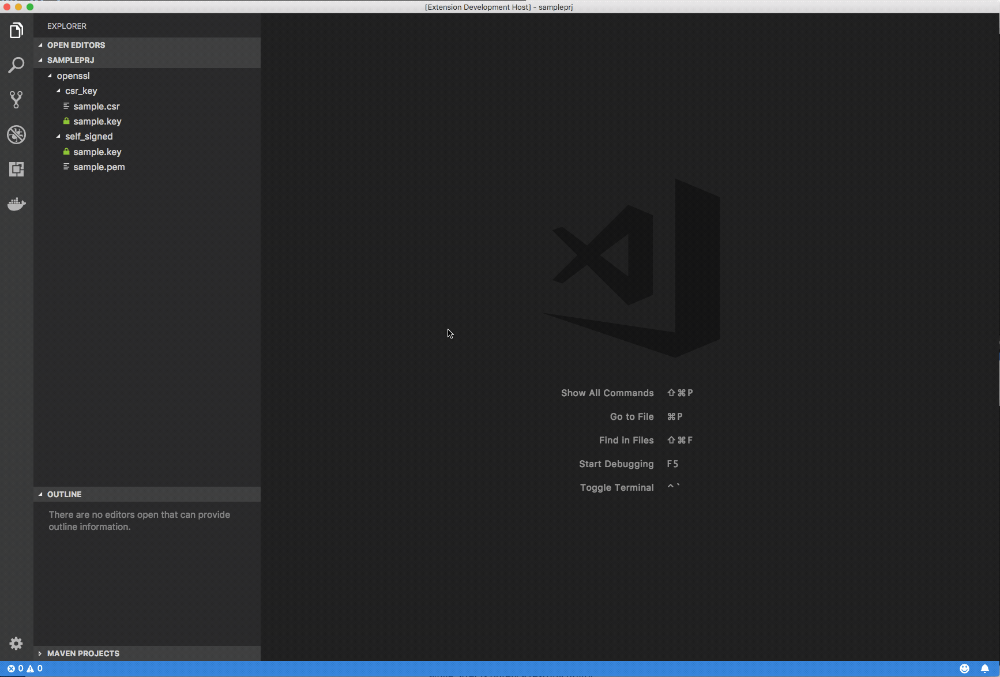

# OpenSSL Utils

OpenSSL utils allows you to invoke the most frequent OpenSSL commands directly from Visual Studio Code.

## Configuration

If openssl in not on your path you can change the `opensslutils.opensslPath` setting to provide the full path to the openssl executable.
For Windows users: in order to use OpenSSL through Windows Subsystem for Linux (WSL) you must set `opensslutils.useWsl` to true.

## Features

### Generate Private Key

### Generate RSA Private Key and Certificate Signing Request 

### Generate self-signed Certificate and Private Key

### Certificate and CSR preview

### Export PKCS#12

### Convert PEM encoded Certificate to DER

### Convert DER encoded Certificate to PEM

## Requirements

You must have OpenSSL 0.9.8 or greater in your PATH.

## Known Issues

At the time of writing this README there are no known issues.

## Release Notes

### 1.1.1

* add support to use openssl through Windows Subsystem for Linux on Windows

### 1.0.1

* Fix a css issue on Windows
* Add a setting to specify the full path to the openssl executable.
* Using the PKCS#12 export command, show an error message if no workspace has been opened.

## Contributors

* Omar de Mingo
* Fabrizio Balsamo

## License

OpenSSL Utils is licensed under the MIT license.
